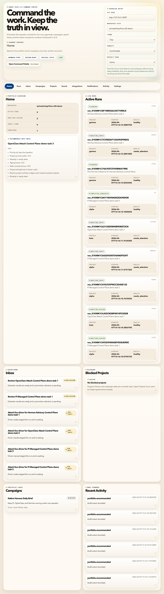

# Agent Hive

[](https://github.com/intertwine/hive-orchestrator/actions/workflows/ci.yml)
[](https://github.com/intertwine/hive-orchestrator/actions/workflows/projection-sync.yml)



Agent Hive is a repo-native control plane for autonomous work. In v2.5, that means you can keep existing worker flows like Codex, Claude Code, and local/manual execution while operating them through a browser-first command center and, if you want, a thin desktop beta shell.

**Keep your agent. Add a control plane.**

If you are already using coding agents and feeling the limits of isolated sessions, Agent Hive is the layer that makes them feel like part of one real system:

- one command center above many runs and many projects
- one governed loop instead of “the agent said it was done”
- one inspectable substrate instead of hidden agent state
- one place to steer Pi, OpenClaw, Hermes, Codex, Claude Code, local execution, and manual handoffs

The center of gravity in this repository is the Hive v2 substrate. v2.3 established the truthful operator surface; v2.4 extends it into native Pi, OpenClaw, and Hermes companion flows; v2.5 turns that foundation into the first command-center release.

## Why It Feels Different

- The console is not a toy dashboard. The browser command center is a real operator surface with active runs, inbox items, notifications, campaign reasoning, retrieval traces, and run detail in one place.
- Hive does not replace your worker harness. It sits above it, so you can keep using Pi, OpenClaw, Hermes, Codex, Claude Code, local execution, or manual loops.
- Native companion paths are real now: Pi can `open` or `attach`, OpenClaw can attach a live gateway `sessionKey`, and Hermes can attach or import trajectories without bulk-importing private memory.
- Agents do not decide when they are done. `PROGRAM.md` evaluators and promotion policy do.
- Machine state stays explicit. Tasks, runs, memory, events, briefs, and campaigns live in predictable files instead of hidden session state.
- You can get to a real governed loop in minutes, not after wiring up a framework.

## Try It In 90 Seconds

```bash
uv tool install 'mellona-hive[console]'
mkdir my-hive && cd my-hive
git init
hive onboard demo --prompt "Create a small React website about bees."
hive console serve
```

That gives you a live operator console at `http://127.0.0.1:8787/console/` and a workspace with
one project, three starter tasks, and a safe governance policy. From there:

```bash
hive next --project-id demo
hive work --owner <your-name>
# make changes inside the run worktree that hive work printed
hive finish <run-id>
```

The console shows you what just happened, what is running, and what needs attention. The CLI
stays available for power users and agent integrations.

> **CLI-only install:** If you do not need the console, `uv tool install mellona-hive` gives you
> the base CLI without the web UI dependencies.

## Desktop Beta From Source

Hive v2.5 also includes a thin Tauri desktop shell around the same command center. It is a
desktop beta, not a separate product line, and the browser console remains the primary
supported path.

Important truth today:

- the normal `mellona-hive[console]` install gives you the CLI and browser console, not a native desktop app
- the desktop shell is currently a source-build path from this repository
- tray actions, native notifications, and `agent-hive://` deep links are implemented
- native update checks and a packaged updater are not wired yet

If you want the desktop beta details, build path, permissions, and current limits, read
[docs/DESKTOP_BETA.md](docs/DESKTOP_BETA.md).

## Start Here

There are four clean ways into Hive:

- [Connect Pi, OpenClaw, or Hermes](docs/START_HERE.md#native-harness-paths) if you want first value inside the harness you already use
- [Install Hive](docs/START_HERE.md) if you want a fresh workspace and the shortest path to real work
- [Adopt Hive in an existing repo](docs/ADOPT_EXISTING_REPO.md) if you already have a codebase and want Hive inside it
- [Maintain or publish Hive](docs/MAINTAINING.md) if you are working on this repository itself

If you only read one more page after this README, make it [docs/START_HERE.md](docs/START_HERE.md).

## Install Hive

`mellona-hive` is the package you install. Mellona is the distribution family, Agent Hive is the current product,
and the install gives you the `hive` command.

Use [docs/START_HERE.md](docs/START_HERE.md) for the canonical install matrix, optional extras, and git-install
fallback. The fastest base install for most users is:

```bash
uv tool install 'mellona-hive[console]'
```

```bash
hive --version
hive doctor
```

The `[console]` extra gives you `hive console serve`, the live operator UI. For CLI-only environments
(CI, headless servers), `uv tool install mellona-hive` works without web dependencies.

Add `mellona-hive[mcp]` when you want the thin `hive-mcp` adapter for MCP integration.

If you plan to use hosted or self-hosted sandbox execution, add `mellona-hive[sandbox-e2b]`
or `mellona-hive[sandbox-daytona]` extras:

- `uv tool install --upgrade 'mellona-hive[console,sandbox-e2b]'`
- `uv tool install --upgrade 'mellona-hive[console,sandbox-daytona]'`

Then verify what this machine can really support:

```bash
hive sandbox doctor --json
```

## Five-Minute First Run

Start in an empty directory and let Hive onboard the workspace for you:

```bash
mkdir my-hive
cd my-hive
git init
hive onboard demo --prompt "Create a small React website about bees."
hive console serve
```

That gives you a real workspace with `.hive/`, a starter project, a safe default `PROGRAM.md`, and the first task
chain. Open `http://127.0.0.1:8787/console/` to see the operator console. The longer walkthrough lives in
[docs/QUICKSTART.md](docs/QUICKSTART.md).

Fresh onboarded projects may start with the placeholder `local-smoke` evaluator so the first governed loop works
immediately. Replace it with a real repo-specific evaluator before you trust autonomous promotion.

What a healthy first pass looks like:

- `hive onboard demo` leaves you with one ready task and a safe starter `PROGRAM.md`
- `hive work` starts a governed run, prints the run worktree path, and can write a handoff bundle for your worker harness
- a first `hive finish` may either promote a real change or cleanly say there was nothing to promote yet

If that first `hive finish` reports no changes, that is usually a healthy noop, not a broken setup. To intentionally
see a successful first promotion, make one tiny docs-only change while working the demo task, then finish the run.
Make that change inside the run worktree that `hive work` printed for you, usually `.hive/worktrees/run_<id>/`.

If the promoted task lands in `review`, close it explicitly to unblock the next task in the starter chain:

```bash
hive task update <task-id> --status done
```

Do this in a fresh workspace, not inside this repository checkout. This repo carries its own real maintainer task queue, so `hive task ready` here will show Hive's work unless you filter to `--project-id demo`.

Once the workspace exists, the normal loop is:

```bash
hive next --project-id demo
hive work --owner <your-name>
hive finish <run-id>
```

`hive finish` evaluates the run, accepts or escalates it, and promotes accepted work back into the workspace by
default. Open the console when you want the live run board, inbox, campaigns, project summaries, and run detail in one
place.

## Adopt Hive In An Existing Repo

You do not need to start over to use Hive.

If you already have a repository:

```bash
cd your-repo
hive adopt app --title "App"
```

From there, either keep the guided adoption path or import an older checklist-based Hive setup with
`hive migrate v1-to-v2`. The full path is documented in
[docs/ADOPT_EXISTING_REPO.md](docs/ADOPT_EXISTING_REPO.md).

## Everyday Loop

Once the workspace exists, the daily path is short:

```bash
hive next
hive work --owner <your-name>
hive finish <run-id>
```

If you want to stay closer to the underlying primitives, `hive task ready`, `hive task claim`, `hive context startup`,
and `hive run start` are still there. `--json` is available across the CLI when you want to script Hive instead of
reading it by eye.

When you want the live operator view instead of the raw CLI, install `mellona-hive[console]` first and run:

```bash
hive console serve
```

That starts the browser command center. From there you can watch active runs, review inbox items, inspect context,
see acceptance rationale, and steer runs without editing Markdown by hand.

When you are defining new work instead of just taking ready work, stay in the CLI:

```bash
hive task create \
  --project-id <project-id> \
  --title "Add the next thin slice" \
  --label launch \
  --relevant-file src/app.py \
  --acceptance "Tests pass for the new slice."
```

## Optional Integrations

These are useful, but the base CLI works fine without them:

- `hive console serve` after installing `mellona-hive[console]`
- `hive-mcp` after installing `mellona-hive[mcp]`
- the optional Claude Code GitHub App flow in [docs/INSTALL_CLAUDE_APP.md](docs/INSTALL_CLAUDE_APP.md)

The MCP surface stays intentionally small: `search` and `execute`. `execute` is a bounded local Python helper, not a
full sandbox.

## Native Harnesses

If you already live inside Pi, OpenClaw, or Hermes, do not start with a generic `hive work` loop. Start inside the native harness and attach or open from there.

- [Pi harness guide](docs/recipes/pi-harness.md): install `@mellona/pi-hive`, run `hive integrate doctor pi --json`, then use `pi-hive open ...` for governed work or `pi-hive attach ...` for advisory continuation.
- [OpenClaw harness guide](docs/recipes/openclaw-harness.md): install the `agent-hive` skill plus `openclaw-hive-bridge`, run `hive integrate doctor openclaw --json`, then attach the current `sessionKey` without relaunch.
- [Hermes harness guide](docs/recipes/hermes-harness.md): run `hive integrate doctor hermes --json`, load the Agent Hive skill/toolset, then attach a live Hermes session or import a trajectory fallback.

The short version:

- Pi gives you both `open` and `attach`
- OpenClaw is attach-only in v2.4 and always advisory
- Hermes is attach/import in v2.4 and always advisory

## Compare Harnesses

Hive does not ask you to switch worker tools. It gives them a shared control layer.

- Pi is strong when you want a real native companion with both governed `open` and advisory `attach`.
- OpenClaw is strong when you want to keep chatting in an existing gateway session and let Hive observe and steer it as an advisory delegate.
- Hermes is strong when you want Hermes-native skills, attach-first supervision, and privacy-preserving trajectory import fallback.
- Codex is strong when you want a powerful coding worker with worktree-aware runs and good local iteration.
- Claude Code is strong when you want broader repo search, longer synthesis, and a handoff-friendly transcript pack.
- Local and manual drivers are useful when you want bounded execution, custom tooling, or a human review step.

The longer comparison lives in [docs/COMPARE_HARNESSES.md](docs/COMPARE_HARNESSES.md).

## Core Model

| File or directory | Purpose |
|---|---|
| `.hive/tasks/*.md` | Canonical task records |
| `.hive/runs/*` | Run artifacts, evaluator output, logs, patch data |
| `.hive/memory/` | Project-local observational memory |
| `.hive/events/*.jsonl` | Append-only audit log |
| `.hive/cache/index.sqlite` | Derived query cache |
| `projects/*/AGENCY.md` | Human project document and bounded rollups |
| `projects/*/PROGRAM.md` | Policy for autonomous work |
| `GLOBAL.md` | Top-level workspace orientation |
| `AGENTS.md` | Short compatibility shim for coding harnesses |

## More Docs

- [docs/START_HERE.md](docs/START_HERE.md) for the lane chooser and install matrix
- [docs/QUICKSTART.md](docs/QUICKSTART.md) for the fresh-workspace walkthrough
- [docs/ADOPT_EXISTING_REPO.md](docs/ADOPT_EXISTING_REPO.md) for existing repositories and legacy imports
- [docs/DEMO_WALKTHROUGH.md](docs/DEMO_WALKTHROUGH.md) for the current demo walkthrough, screenshots, and narration built on the multi-project launch fixture
- [docs/COMPARE_HARNESSES.md](docs/COMPARE_HARNESSES.md) for Pi, OpenClaw, Hermes, Codex, Claude Code, and local/manual guidance
- [docs/UI_INFORMATION_ARCHITECTURE.md](docs/UI_INFORMATION_ARCHITECTURE.md) for the console information architecture
- [docs/OPERATOR_FLOWS.md](docs/OPERATOR_FLOWS.md) for the manager loop and steering flows
- [docs/MAINTAINING.md](docs/MAINTAINING.md) for source-checkout work
- [docs/RELEASING.md](docs/RELEASING.md) for tagged releases, PyPI, and Homebrew
- [docs/recipes/pi-harness.md](docs/recipes/pi-harness.md) for the Pi native companion path
- [docs/recipes/openclaw-harness.md](docs/recipes/openclaw-harness.md) for the OpenClaw gateway attach path
- [docs/recipes/hermes-harness.md](docs/recipes/hermes-harness.md) for the Hermes skill/attach path
- [docs/recipes/sandbox-doctor.md](docs/recipes/sandbox-doctor.md) for sandbox profiles, extras, and doctor output

## Maintainers

This repository runs on the same Hive v2 substrate it ships, but the source checkout is still a maintainer
surface, not the normal installed-user path. If you are here to work on Hive itself, start with
[docs/MAINTAINING.md](docs/MAINTAINING.md).
