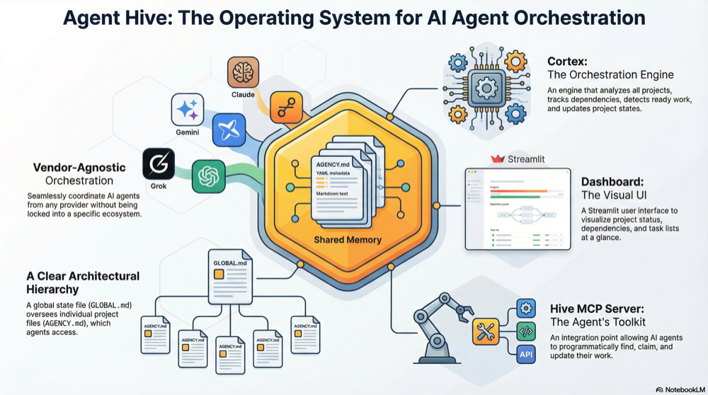

# Agent Hive

[](https://github.com/intertwine/hive-orchestrator/actions/workflows/ci.yml)
[](https://github.com/intertwine/hive-orchestrator/actions/workflows/projection-sync.yml)



Agent Hive is a CLI-first orchestration platform for autonomous agents. It keeps machine state in a Git-friendly substrate under `.hive/`, keeps human context in Markdown, and gives agents a stable command surface instead of brittle prompt rituals.

The center of gravity in this repository is Hive 2.0:

- `hive` is the primary interface.
- `.hive/tasks/*.md` is the canonical task store.
- `projects/*/AGENCY.md` stays human-readable.
- `projects/*/PROGRAM.md` defines evaluator, path, and command policy.
- `GLOBAL.md` and `AGENTS.md` are bounded projections, not the machine database.

## Why Hive

- It keeps the machine state explicit. Tasks, runs, memory, events, and cache live in predictable files.
- It keeps humans in the loop. Project docs stay readable, diffable, and easy to review.
- It gives agents a real operating surface. Ready work, claims, runs, evaluators, search, context assembly, and migration are all available through the CLI.

## Install

### Easiest path today

Use `uv tool` directly from GitHub:

```bash
uv tool install --from git+https://github.com/intertwine/hive-orchestrator.git agent-hive
hive doctor --json
```

### From a local checkout

```bash
git clone https://github.com/intertwine/hive-orchestrator.git
cd hive-orchestrator
make install
make install-tool
hive doctor --json
```

### Release channels

This repo now includes release automation for PyPI and Homebrew. Until the first tagged public release is cut, the git-based `uv tool install` flow above is the simplest path. After a release, the intended install commands are:

```bash
uv tool install agent-hive
pipx install agent-hive
pip install agent-hive
brew install intertwine/tap/agent-hive
```

## Five-Minute Tour

Bootstrap a workspace:

```bash
hive init --json
hive doctor --json
```

Create a project and a first task:

```bash
hive project create demo --title "Demo project" --json
hive task create --project-id demo --title "Define the first slice" --json
```

Find ready work and build startup context:

```bash
hive task ready --json
hive context startup --project demo --json
```

Refresh human-facing projections after canonical state changes:

```bash
hive sync projections --json
```

Need a copy-paste startup bundle for an agent session:

```bash
make session PROJECT=demo
```

If you want a visual view, run:

```bash
make dashboard
```

## Core Model

| File or directory | Purpose |
|---|---|
| `.hive/tasks/*.md` | Canonical task records |
| `.hive/runs/*` | Run artifacts, evaluator output, logs, patch data |
| `.hive/memory/` | Project-local observational memory |
| `.hive/events/*.jsonl` | Append-only audit log |
| `.hive/cache/index.sqlite` | Derived query cache |
| `projects/*/AGENCY.md` | Human project document and bounded rollups |
| `projects/*/PROGRAM.md` | Policy for autonomous work |
| `GLOBAL.md` | Top-level workspace orientation |
| `AGENTS.md` | Short compatibility shim for coding harnesses |

## Typical Workflow

1. Create or sync a workspace with `hive init` and `hive sync projections`.
2. Scaffold a project with `hive project create`.
3. Create canonical tasks with `hive task create`.
4. Use `hive task ready` to find work and `hive task claim` to lease it.
5. Start work with `hive context startup` or a governed run via `hive run start`.
6. Evaluate, accept, reject, or escalate with the `hive run` commands.

## What Ships In This Repo

### Core CLI

The CLI covers:

- workspace bootstrap and health checks
- project discovery and scaffolding
- task CRUD, claims, and ready ranking
- governed runs and evaluator execution
- project-local and optional global memory
- startup and handoff context assembly
- workspace search
- one-time import for older checklist-based repos

### Optional adapters

These are useful, but not required:

- Streamlit dashboard in `src/dashboard.py`
- thin search/execute MCP adapter in `src/hive_mcp/server.py`
- optional GitHub issue dispatcher in `src/agent_dispatcher.py`
- optional Claude GitHub App integration in `docs/INSTALL_CLAUDE_APP.md`

The core CLI does not require an LLM API key.

## Development

Install dev dependencies and run the quality gates:

```bash
make install-dev
make check
```

Build release artifacts:

```bash
make build
```

Generate a Homebrew formula after publishing a release to PyPI:

```bash
make brew-formula
```

## Release Automation

The repository now includes:

- `/.github/workflows/ci.yml` for lint and test gates on push and pull request
- `/.github/workflows/release.yml` for tagged releases, PyPI trusted publishing, and Homebrew tap updates
- `scripts/bump_version.py` for repeatable version bumps
- `scripts/generate_homebrew_formula.py` for Homebrew formula generation from published artifacts

### PyPI

`release.yml` is set up for PyPI trusted publishing. Configure this repository as a trusted publisher in PyPI before tagging a release.

If you prefer manual publishing, the local path is still available:

```bash
TWINE_USERNAME=__token__ TWINE_PASSWORD=<pypi-token> make publish
```

### Homebrew

Homebrew release automation expects:

- repository variable `HOMEBREW_TAP_REPO`
- repository secret `HOMEBREW_TAP_GITHUB_TOKEN`

For local tap updates:

```bash
make release-homebrew HOMEBREW_TAP_DIR=../homebrew-tap
```

## Optional Environment Variables

```bash
HIVE_BASE_PATH=/path/to/workspace
HIVE_GLOBAL_MEMORY_DIR=/custom/global-memory
COORDINATOR_URL=http://localhost:8080
WANDB_API_KEY=your-wandb-api-key
WEAVE_PROJECT=agent-hive
```

`COORDINATOR_URL` and Weave tracing are optional. The core CLI works fine without them.

## Migration

If you are bringing an older repo forward, import it once and then stay in the canonical task flow:

```bash
hive migrate v1-to-v2 --json
```

To replace the old checklist section with a generated rollup:

```bash
hive migrate v1-to-v2 --rewrite --json
```

## Repository Layout

```text
.
├── .github/workflows/
├── .hive/
├── docs/
├── examples/
├── packaging/homebrew/
├── projects/
├── scripts/
├── src/
└── tests/
```

## Status

This repository runs on the same Hive 2.0 substrate it ships. Projection sync and ready-work snapshots run in GitHub Actions, and the repo carries live canonical task, run, memory, and projection state.
