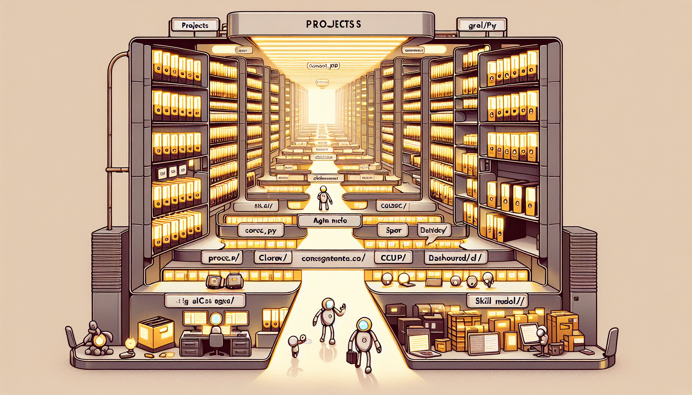
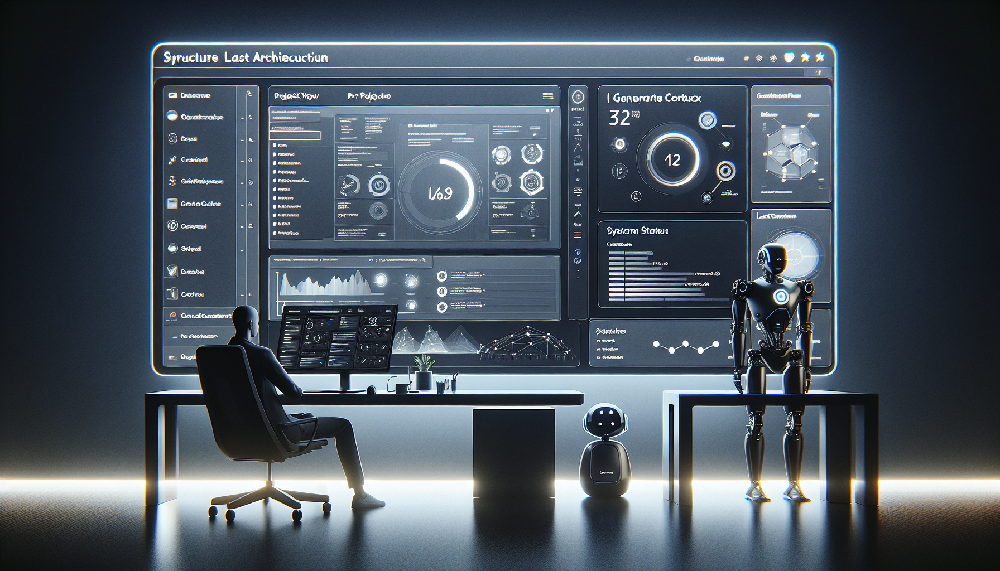

# Getting Started: Your First Agent Hive Project

_This is the hands-on entry point for the Hive article series._

---


_Hive is easiest to understand when you use it. Install the CLI, create a workspace, make a project, and run a real work loop._

---

## Start Here

Hive does not ask you to buy into a giant framework before you can get useful work done.

You install a CLI. You initialize a workspace. You create a project. You create canonical tasks. Then you let people and agents work against the same durable state.

Two things are worth calling out up front:

- You do not need an LLM API key to use the core Hive CLI.
- Everyday users and maintainers have different jobs. Everyday users should focus on `hive` commands. Maintainers of Hive itself should worry about release automation, Homebrew, and PyPI.

This guide is for the first group.

If you are reading from the Hive repository checkout itself, remember that the repo also carries maintainer tasks and release tooling. The clean product experience is still the installed CLI in a fresh workspace.

## Step 1: Install Hive

Use the public install path that matches how you normally work.

If you like standalone tools managed by `uv`:

```bash
uv tool install agent-hive
hive --version
```

If you prefer `pipx`:

```bash
pipx install agent-hive
hive --version
```

If you use Homebrew:

```bash
brew tap intertwine/tap
brew install intertwine/tap/agent-hive
hive --version
```

If you're reading this before the public package is live, the GitHub fallback works too:

```bash
uv tool install --from git+https://github.com/intertwine/hive-orchestrator.git agent-hive
hive --version
```

## Step 2: Create a Workspace

Pick a clean directory and bootstrap it:

```bash
mkdir my-hive
cd my-hive
hive init --json
hive doctor --json
```

After `hive init`, you will have a workspace that looks roughly like this:

```text
my-hive/
├── .hive/
│   ├── cache/
│   ├── events/
│   ├── memory/
│   ├── runs/
│   └── tasks/
├── AGENTS.md
├── GLOBAL.md
└── projects/
```

The split matters:

- `.hive/` is the machine substrate.
- `projects/*/AGENCY.md` is the human project document.
- `projects/*/PROGRAM.md` is the autonomy and evaluator policy.


_Hive keeps machine state and human context separate on purpose. Agents need structure. Humans need readable documents._

## Step 3: Create Your First Project

Let's make something concrete:

```bash
hive project create demo --title "Configuration system" \
  --objective "Build a configuration layer with file defaults and environment overrides." \
  --json
```

That creates:

- `projects/demo/AGENCY.md`
- `projects/demo/PROGRAM.md`

Open both files once before you go further.

`AGENCY.md` is where you keep narrative context, architecture notes, links, and handoffs.  
`PROGRAM.md` is where you define what autonomous runs are allowed to do.

For a new project, the default `PROGRAM.md` is intentionally conservative. That's a feature, not a missing piece.

## Step 4: Create Canonical Tasks

Now add real work:

```bash
hive task create --project-id demo --title "Design the configuration schema" --priority 1 --json
hive task create --project-id demo --title "Implement the configuration loader" --priority 1 --json
hive task create --project-id demo --title "Write tests for environment overrides" --priority 2 --json
```

If one task depends on another, link it explicitly:

```bash
hive task link task_ABC blocks task_DEF --json
```

Then check the ready queue:

```bash
hive task ready --json
```

This is one of the biggest mental shifts in Hive v2: checkbox lists are no longer the machine database. Ready work comes from canonical task state under `.hive/tasks/*.md`.

## Step 5: Claim Work and Build Context

When you're ready to work, claim a task:

```bash
hive task claim task_ABC --owner bryan --ttl-minutes 60 --json
```

Then build a startup bundle:

```bash
hive context startup --project demo --task task_ABC --json
```

That context pulls together:

- the project narrative from `AGENCY.md`
- the task you claimed
- `PROGRAM.md` policy
- recent memory
- relevant search hits and accepted run summaries

This is the normal daily-use path for Hive. You do not need a dashboard or dispatcher to get value from it.


_The dashboard is optional. The real center of gravity is the CLI and the canonical state it operates on._

## Step 6: Do the Work

You have two common options.

### Option A: Work directly

Use the startup context yourself, make code changes, and update task state as you go:

```bash
hive task update task_ABC --status running --json
```

When the work is ready for review:

```bash
hive task update task_ABC --status review --json
hive sync projections --json
```

### Option B: Use a governed run

If the project's `PROGRAM.md` defines allowed evaluator commands, you can use the run engine:

```bash
hive run start task_ABC --json
hive run show run_ABC --json
hive run eval run_ABC --json
```

Then one of three things happens:

```bash
hive run accept run_ABC --json
hive run reject run_ABC --reason "Tests still failing" --json
hive run escalate run_ABC --reason "Needs human review on infra changes" --json
```

That gives you artifacts, logs, patch data, summaries, and evaluation results under `.hive/runs/`.

## Step 7: Keep Human Docs Fresh

When task state, runs, or memory change, regenerate the human-facing rollups:

```bash
hive sync projections --json
```

That refreshes:

- `GLOBAL.md`
- `projects/*/AGENCY.md`
- `AGENTS.md`

The important detail is that these files are projections now. They help humans stay oriented, but they are not the canonical machine state.


_`AGENCY.md` still matters. It just has a better job now: human context, handoffs, and bounded generated rollups._

## Step 8: Add Memory

If you want Hive to carry more context across sessions, record observations:

```bash
hive memory observe --note "Chose env var precedence over file defaults for local overrides." --json
hive memory reflect --json
```

Then search that memory later:

```bash
hive memory search "configuration precedence" --project demo --json
```

This is especially useful when multiple agents, or the same human across several days, are touching the same project.

## Optional Extras

These are useful, but they are not required to get started:

- `make dashboard` from a local checkout if you want a Streamlit view while maintaining Hive itself
- `make session PROJECT=demo` from a local checkout if you want a saved startup bundle
- the Claude GitHub App if you want issue-driven workflows
- the MCP server if you want a thin `search` and `execute` surface for agent harnesses

Use them because they help, not because Hive needs them to function.

## Troubleshooting

### "I initialized the workspace, but nothing is ready"

That usually means one of two things:

- you haven't created any canonical tasks yet
- all current tasks are blocked, claimed, or done

Run:

```bash
hive doctor --json
hive task list --json
```

### "I edited AGENCY.md, but the ready queue didn't change"

That's expected if you only changed narrative content. The ready queue comes from `.hive/tasks/*.md`.

### "The run engine says my evaluator command is not allowed"

Open `projects/<slug>/PROGRAM.md` and check `commands.allow` plus `evaluators`. Hive is strict on purpose.

## What Good Looks Like

After your first hour with Hive, you should have:

- a clean workspace bootstrapped with `hive init`
- one real project in `projects/demo/`
- a handful of canonical tasks in `.hive/tasks/`
- a repeatable way to find ready work
- a startup context you can hand to yourself, Claude Code, OpenCode, Codex, or another harness

That is enough to start doing real work.

Everything else in Hive builds on top of that loop.

## Quick Reference

```bash
# Install
uv tool install agent-hive

# Bootstrap workspace
hive init --json
hive doctor --json

# Create project + tasks
hive project create demo --title "Demo project" --json
hive task create --project-id demo --title "Define the first slice" --json

# Find and claim work
hive task ready --json
hive task claim task_ABC --owner bryan --json

# Build context and refresh projections
hive context startup --project demo --task task_ABC --json
hive sync projections --json
```
