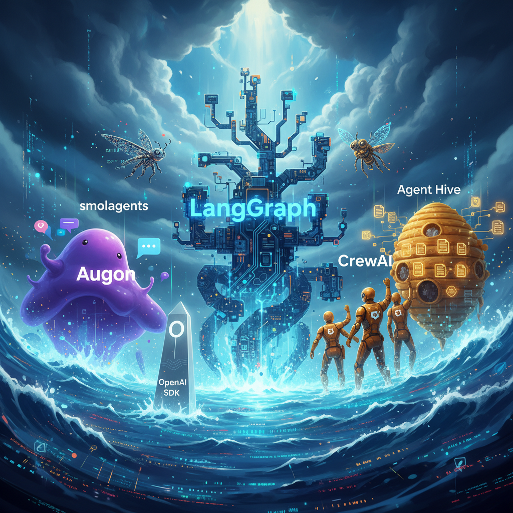

# Agent Hive vs. The Framework Landscape

_A practical comparison, not a cage match._

---

_The agent ecosystem is crowded because people are solving different problems. Hive fits a different layer than most chat-runtime frameworks._

---

## Start With The Right Question

Most framework comparisons start by asking which tool is "best."

That is usually the wrong question.

The better question is: what layer of the system are you trying to solve?

Some tools are execution runtimes. Some are agent team frameworks. Some are tool protocols. Some are long-horizon orchestration systems. Hive belongs in the last group.

Hive is not trying to be the chat loop, the planner, or the coding model. It is trying to make long-running, reviewable, multi-session work hold together over time.

## What Hive Actually Is

Hive v2 is a CLI-first orchestration platform built around a few stable primitives:

- canonical machine state in `.hive/`
- human-readable project docs in `projects/*/AGENCY.md`
- autonomy and evaluator policy in `projects/*/PROGRAM.md`
- explicit task claims, ready queues, run artifacts, memory, and projections

That means Hive is comfortable sitting above other agent tools rather than replacing them.

## A Useful Mental Model

Think about the ecosystem in four layers:

1. **Model providers**: Claude, GPT, Gemini, local models
2. **Interactive harnesses**: Claude Code, OpenCode, Codex, Pi, Hermes
3. **Runtime frameworks**: LangGraph, AutoGen, CrewAI, OpenAI Agents, smolagents
4. **Long-horizon orchestration**: Hive

You can use Hive without layer 3.  
You can use layer 3 without Hive.  
You can also combine them.

That last option is where things get interesting.

## Where Hive Differs

### 1. Durable state is the product

Many agent frameworks focus on the runtime loop:

- who calls which tool
- how messages pass between agents
- how to hand off inside a live execution

Hive focuses on what survives after the loop ends:

- what is still ready
- what is blocked
- what policy governed the work
- what run artifacts were produced
- what a new session needs to know

That makes Hive a better fit for work that spans hours, days, reviewers, and model swaps.

### 2. Human readability is not optional

Hive keeps the machine substrate structured, but it still treats Markdown as part of the interface.

That matters because long-horizon systems fail in messy, human ways:

- priorities change
- a task needs explanation, not just status
- reviewers need to understand why a run was accepted
- a new agent needs orientation fast

SQLite alone does not solve that. Neither does a wall of hidden framework state.

### 3. Policy is explicit

`PROGRAM.md` is not window dressing. It is the contract for autonomous work:

- allowed paths
- denied paths
- evaluator commands
- promotion rules
- escalation rules
- budgets

If a run crosses a line, Hive has somewhere concrete to point.

### 4. Git review stays central

Hive assumes you still want diffs, branches, artifacts, and human review.

That may sound conservative if you come from more autonomous agent demos. In practice, it is what makes teams trust the system.

## Comparison By Layer

| Tool family | Best at | Where Hive differs |
|---|---|---|
| LangGraph-style runtimes | Stateful execution graphs and branching workflows | Hive is better at cross-session continuity and repo-native review |
| Crew/team frameworks | Role-based collaboration inside a running session | Hive is better at durable work tracking across sessions and harnesses |
| AutoGen/conversation frameworks | Multi-agent conversation loops | Hive is better when you need explicit state, claims, and handoff artifacts |
| OpenAI Agents / lightweight agent SDKs | Simple hosted agent loops and tool calling | Hive is better for long-running work that must survive provider or harness changes |
| smolagents / code-first runtimes | Fast tool use and code-driven behavior | Hive is better as the surrounding operating layer |
| MCP | Tool connectivity standard | Hive can use MCP, but it is not itself just a tool bus |
| OpenCode / Claude Code / Codex | Interactive agent harnesses | Hive coordinates work above them and gives them shared state |

## When Hive Is The Right Fit

Hive starts to shine when at least three of these are true:

- work spans multiple sessions
- more than one human or agent may touch the same project
- you want Git-native review
- you need a ready queue, not just a prompt
- you want the ability to swap harnesses or models later
- you care about explicit policy for autonomous work

If you just need a one-shot agent loop that routes a few tool calls, Hive may be more structure than you need.

## When To Combine Hive With Other Tools

Some of the best setups look like this:

### Hive + Claude Code

Use Hive for orchestration, claims, runs, and projections. Use Claude Code as the interactive coding harness.

### Hive + OpenCode

Same orchestration layer, different harness. This is a good fit if you want vendor flexibility in the everyday coding tool.

### Hive + LangGraph or another runtime

Use the runtime inside a bounded run for a single task, while Hive manages the surrounding project lifecycle.

### Hive + MCP

Use MCP for tool access. Use Hive for state, policy, and work coordination.

That layering is often cleaner than trying to make one framework do every job.

## The Tradeoff Hive Makes On Purpose

Hive asks you to be explicit.

You create projects.
You create tasks.
You define policy.
You sync projections.
You decide when runs are accepted.

That is more ceremony than a "just talk to the agent" demo.

It is also why Hive ages better once the work gets real.

## What Hive Is Not Trying To Win

Hive is not trying to be:

- the smartest single-session coding agent
- the most magical autonomous demo
- the shortest path from prompt to spectacle

It is trying to be the system you can still trust on week three, with multiple contributors, a review queue, and a repo full of state that still makes sense.

That is a different standard.

## Bottom Line

If you want a runtime, use a runtime.  
If you want a harness, use a harness.  
If you want long-horizon orchestration that survives model churn, human review, and real project complexity, that is where Hive belongs.

The best teams will not pick one of these categories forever.
They will stack them.

Hive was designed to be the part of that stack that keeps the whole thing coherent.
