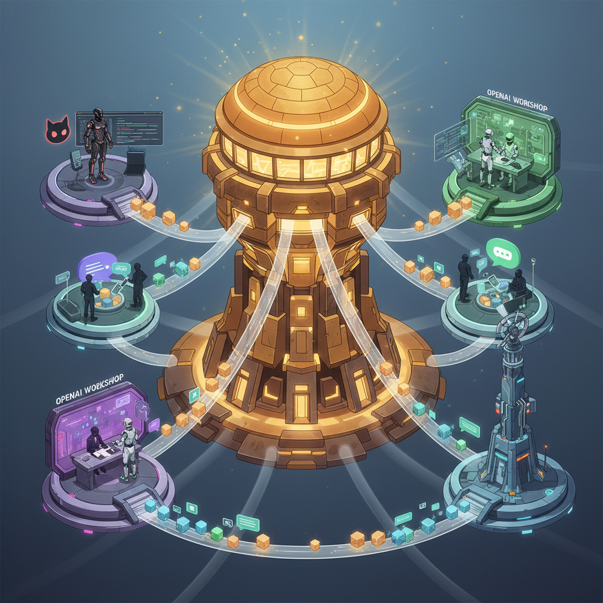

# Building Extensible Agent Dispatchers

_How to route Hive work into whatever agent surface your team actually uses._

---


_A dispatcher should be a transport layer, not a second orchestrator with its own secret state._

---

## What A Dispatcher Is For

Hive already knows how to answer the hard questions:

- what work is ready
- what is blocked
- what task is already claimed
- what policy applies to the project
- what context a new session needs

A dispatcher should not re-implement that logic.

Its job is much narrower:

1. ask Hive for the next unit of work
2. package the right context
3. deliver that work into another system
4. record enough state for the loop to stay coherent

That might mean a GitHub issue, a Slack message, a queue entry, an OpenCode task, or an internal job runner.

## The Core Rule

The dispatcher is not the source of truth.

The canonical source of truth is still:

- `.hive/tasks/*.md`
- `.hive/runs/*`
- `.hive/memory/`
- `projects/*/PROGRAM.md`

That sounds obvious, but it is where many "agent router" systems go wrong. They start by calling the main system, then slowly grow their own claim logic, retry logic, status model, and completion semantics until nobody knows which system is authoritative anymore.

Hive dispatchers should stay thin on purpose.

## The Four-Step Pattern

### 1. Find work

Use Hive's ready queue:

```bash
hive task ready --json
```

That gives you canonical readiness based on task status, dependency edges, claim expiry, and project state.

### 2. Build context

Use Hive's context surface:

```bash
hive context startup --project demo --task task_ABC --json
```

That keeps the packaging logic centralized. A dispatcher should not be hand-assembling project context from random files if Hive can already do it.

### 3. Deliver the task

Push the packaged work into the destination system:

- create a GitHub issue
- post to Slack
- enqueue a job
- invoke an agent harness
- create a human work item in an internal tool

The delivery target is the customizable part.

### 4. Close the loop

When work succeeds, fails, or needs help, come back through Hive:

```bash
hive task claim task_ABC --owner claude-code --json
hive task update task_ABC --status review --json
hive run accept run_ABC --json
hive run reject run_ABC --reason "Tests failed" --json
```

This is how you keep dispatchers from drifting into becoming their own workflow engine.

## A Minimal Dispatcher Skeleton

You can build a useful dispatcher with ordinary CLI calls:

```python
import json
import subprocess


def hive_json(*args: str) -> dict:
    result = subprocess.run(
        ["hive", *args, "--json"],
        check=True,
        text=True,
        capture_output=True,
    )
    return json.loads(result.stdout)


def dispatch_once(owner: str = "claude-code") -> None:
    ready = hive_json("task", "ready").get("tasks", [])
    if not ready:
        return

    task = ready[0]
    context = hive_json(
        "context",
        "startup",
        "--project",
        task["project_id"],
        "--task",
        task["id"],
    )

    issue_url = create_issue_from_context(task, context)
    if issue_url:
        hive_json("task", "claim", task["id"], "--owner", owner)
```

The delivery function is yours. The coordination stays with Hive.

## Delivery Targets That Make Sense

### GitHub issues

This is the most natural target when you want:

- a visible work queue
- human discussion in the open
- PR-driven completion
- easy review requests

The built-in optional dispatcher in `src/agent_dispatcher.py` is this pattern.

### Chat systems

Useful when humans and agents share the same operational inbox, but be careful:

- chat is great for awareness
- chat is terrible as canonical state

Let chat carry the alert. Let Hive carry the truth.

### Agent harnesses

A dispatcher can hand work to Claude Code, OpenCode, Codex, or another harness by packaging startup context and invoking the harness-specific entry point.

This is often the cleanest setup because Hive handles orchestration while the harness handles the interactive coding loop.

### Internal job systems

If your company already routes work through queues, schedulers, or internal portals, Hive can feed that system instead of replacing it.

## Claims, Timing, and Idempotency

One practical question always comes up: when should the task be claimed?

The safe answer is:

- do the expensive packaging first
- deliver the work item
- claim only after delivery succeeds

That reduces stranded claims from partial failures.

You still need idempotency:

- avoid delivering the same task twice
- tolerate retries
- record the external reference if the destination system gives you one

If your destination supports deduplication keys, use them.

## Completion Patterns

There are three solid ways to close the loop.

### 1. Direct task updates

The agent or integration writes back through the Hive CLI:

```bash
hive task update task_ABC --status review --json
```

Simple and effective.

### 2. Governed runs

If the work is evaluator-driven, run it through:

```bash
hive run start task_ABC --json
hive run eval run_ABC --json
hive run accept run_ABC --json
```

This is the stronger pattern when you need artifacts, logs, and policy enforcement.

### 3. Human review gates

Sometimes the dispatcher should stop at "work is ready for review" and let a human accept, reject, or escalate.

That is not a failure of automation. It is often the right boundary.

## Search And Execute Change The Shape Of Dispatchers

Hive v2 added a thin `search` and `execute` surface as well:

```bash
hive search "retry logic" --json
hive execute --language python --code 'print("hello")' --json
```

This matters because many dispatchers need just a little bit of tool access:

- search the workspace
- run a bounded script
- inspect context before routing

Once those surfaces exist, the dispatcher can stay smaller. It does not need to carry its own ad hoc tooling bundle.

## Design Rules Worth Keeping

### Keep the dispatcher stateless

If you need history, put it in Hive or in the destination system. Hidden dispatcher state becomes a debugging trap.

### Keep the schema boring

Use stable JSON in and out. Dispatchers become brittle when half the interface lives in natural-language conventions.

### Keep failure modes visible

Delivery failure, claim failure, policy failure, and evaluation failure are different classes of problem. Surface them separately.

### Keep the handoff reviewable

If a dispatcher is sending work to agents, people should still be able to inspect what was sent and why.

## Bottom Line

The most successful Hive dispatchers are the least ambitious ones.

They do not pretend to be an orchestration brain.
They do not invent parallel state.
They do not bury policy in transport code.

They ask Hive what is ready, package the right context, deliver it, and hand control back to Hive when the work comes home.

That restraint is what keeps the whole system composable.
