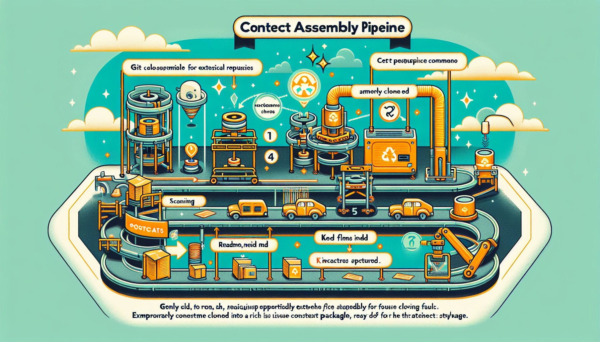
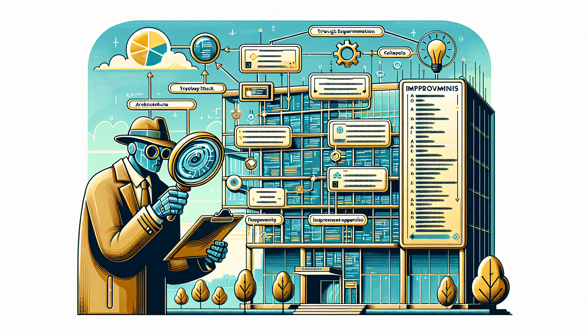
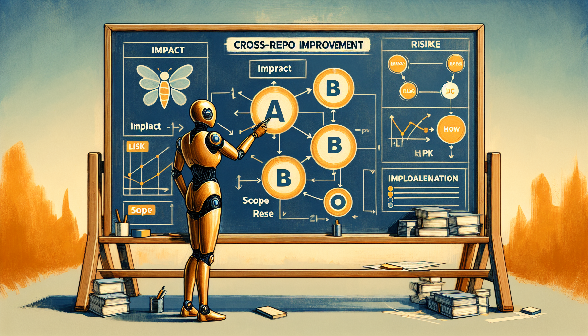
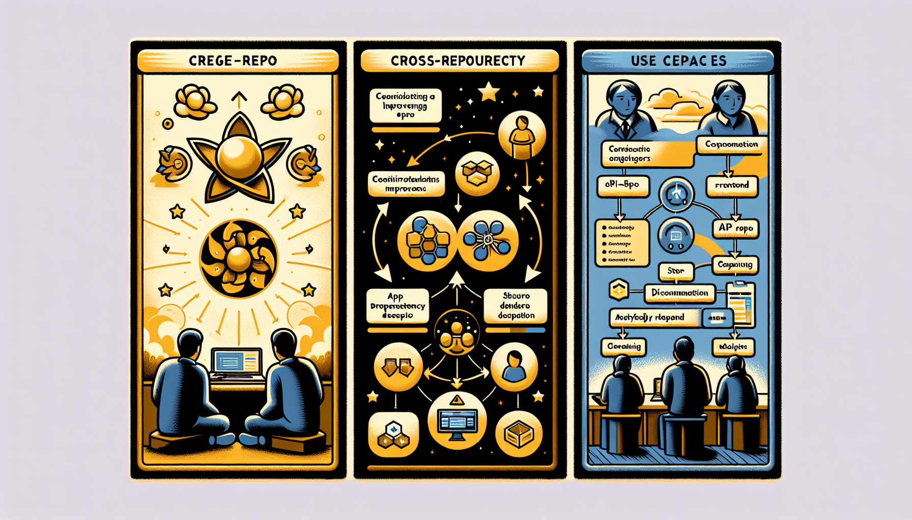

# Cross-Repository Multi-Agent Workflows

How Agent Hive extends beyond single repositories to coordinate AI agents working across multiple GitHub repositories.

---


*Beyond single-repo limits: Agent Hive extends its reach to coordinate AI agents working across any accessible GitHub repository.*

---

## The Challenge

Modern software development rarely happens in isolation. Organizations maintain multiple repositories, contribute to open source projects, and integrate with third-party systems. Traditional AI coding assistants are typically confined to a single repository context, limiting their ability to:

- Contribute improvements to external projects
- Coordinate changes across multiple repositories
- Maintain context when working on interconnected systems

Agent Hive addresses this by extending its file-based protocol to support external repository targets.

## The Solution: target_repo Metadata

Agent Hive introduces a simple extension to the AGENCY.md format:

```yaml
---
project_id: improve-external-lib
status: active
target_repo:
  url: https://github.com/org/external-repo
  branch: main
---
```

When the Dispatcher encounters a project with `target_repo`, it automatically:

1. **Clones the external repository** (shallow clone for efficiency)
2. **Extracts context** (file tree, key files)
3. **Includes it in the issue body** for the agent
4. **Cleans up** temporary files

The agent then has full context to work on the external repository while using AGENCY.md as shared memory.


*One simple extension: Add target_repo to AGENCY.md and the Dispatcher automatically clones, extracts context, and includes external repository data.*

---

## Architecture

```text
┌─────────────────────────────────────────────────────────────────┐
│                     Agent Hive Repository                        │
│                                                                  │
│  projects/external/my-improvement/                              │
│  └── AGENCY.md                                                   │
│      ├── target_repo: https://github.com/org/repo               │
│      ├── Tasks                                                   │
│      ├── Phase 1: Analysis                                       │
│      ├── Phase 2: Strategy                                       │
│      └── Phase 3: Implementation                                 │
│                                                                  │
└─────────────────────────────────────────────────────────────────┘
                              │
                              │ Dispatcher detects ready work
                              ▼
┌─────────────────────────────────────────────────────────────────┐
│                     Context Assembly                             │
│                                                                  │
│  1. Clone https://github.com/org/repo (depth=1)                 │
│  2. Generate file tree                                           │
│  3. Read package.json, README.md, src/index.*                   │
│  4. Build rich issue context                                     │
│  5. Clean up temp directory                                      │
│                                                                  │
└─────────────────────────────────────────────────────────────────┘
                              │
                              │ Creates GitHub Issue
                              ▼
┌─────────────────────────────────────────────────────────────────┐
│                     Agent Execution                              │
│                                                                  │
│  1. Claims project (owner: "claude-code")                       │
│  2. Reads AGENCY.md + external repo context                     │
│  3. Works on current task                                        │
│  4. Writes output to Phase section                              │
│  5. Marks task complete                                          │
│  6. Releases ownership (owner: null)                            │
│                                                                  │
│  When implementation ready:                                      │
│  - Forks external repo                                           │
│  - Creates branch                                                │
│  - Applies changes                                               │
│  - Submits PR                                                    │
│                                                                  │
└─────────────────────────────────────────────────────────────────┘
```


*Context assembly: Clone (depth=1), extract file tree, read key files, build issue context, clean up. All automatic when target_repo is set.*

---

## Multi-Phase Workflows

Cross-repository improvements often benefit from a phased approach:

### Phase 1: Analysis

An agent examines the target repository to understand:

- Architecture and code organization
- Technology stack and dependencies
- Coding patterns and conventions
- Existing issues or areas for improvement

```markdown
## Phase 1: Analysis

### Repository Structure

The repository follows a standard TypeScript/Node.js structure:

- `src/` - Main application code
- `src/services/` - Modular service integrations
- `.github/workflows/` - CI/CD automation

### Technology Stack

- Runtime: Node.js with TypeScript
- APIs: OpenRouter, Tavily, X API v2
- Infrastructure: GitHub Actions, Cloudflare Workers

### Improvement Opportunities

1. Error handling could be more consistent
2. No retry logic for API calls
3. Missing input validation in some services
```


*Phase 1 - Analysis: Before implementing, agents thoroughly examine the target repository—architecture, stack, patterns, opportunities.*

---

### Phase 2: Strategy

Based on the analysis, determine the best improvement:

```markdown
## Phase 2: Strategy

### Selected Improvement

Add exponential backoff retry logic for external API calls.

### Rationale

- High impact: Improves reliability significantly
- Low risk: Additive change, doesn't modify existing logic
- Well-scoped: Can be done in a single PR

### Implementation Plan

1. Create `src/utils/retry.ts` with generic retry function
2. Update service files to use retry wrapper
3. Add configuration for retry attempts and delays
4. Update tests
```


*Phase 2 - Strategy: Evaluate options, select the best improvement, document rationale. High impact, low risk, well-scoped—ready to implement.*

---

### Phase 3: Implementation

Generate the actual code changes:

```markdown
## Phase 3: Implementation

### Files to Create

**src/utils/retry.ts**
\`\`\`typescript
export async function withRetry<T>(
fn: () => Promise<T>,
maxAttempts = 3,
baseDelay = 1000
): Promise<T> {
for (let attempt = 1; attempt <= maxAttempts; attempt++) {
try {
return await fn();
} catch (error) {
if (attempt === maxAttempts) throw error;
const delay = baseDelay \* Math.pow(2, attempt - 1);
await new Promise(resolve => setTimeout(resolve, delay));
}
}
throw new Error('Unreachable');
}
\`\`\`

### PR Title

Add exponential backoff retry logic for API calls

### PR Description

This PR adds a generic retry utility with exponential backoff...
```


*Phase 3 - Implementation: Generate code, prepare files, create the PR. From analysis to strategy to tangible contribution.*

---

## Key Design Decisions

### Why Not a Separate Script?

An earlier design used a dedicated `cross_repo_pipeline.py` script. This was replaced with the file-based approach for several reasons:

1. **Consistency**: Uses the same AGENCY.md protocol as all other projects
2. **Simplicity**: No new commands or workflows to learn
3. **Transparency**: All state is visible in the AGENCY.md file
4. **Flexibility**: Works with existing Cortex/Dispatcher infrastructure

### Why One AGENCY.md Instead of Three?

Multi-phase workflows could use separate AGENCY.md files with dependencies:

```text
phases/
├── 01-analyze/AGENCY.md
├── 02-strategize/AGENCY.md    # blocked_by: [01-analyze]
└── 03-implement/AGENCY.md     # blocked_by: [02-strategize]
```

However, a single file is preferred because:

1. **Single source of truth**: All context in one place
2. **Simpler coordination**: No dependency graph to manage
3. **Better continuity**: Each phase can read previous phases
4. **Easier review**: Humans can see the full workflow at a glance

### Context Assembly

The `context_assembler.py` module handles external repos:

```python
# Detect external repo in metadata
target_repo = metadata.get("target_repo", {})

if target_repo and target_repo.get("url"):
    # Clone and extract context
    repo_path = clone_external_repo(url, branch)
    tree, files = get_external_repo_context(repo_path)

    # Include in issue body
    external_section = build_external_repo_section(tree, files)

    # Clean up
    cleanup_external_repo(repo_path)
```

Key files automatically read:

- `package.json` / `pyproject.toml`
- `README.md`
- `src/index.ts` / `src/main.py`


*Single source of truth: One AGENCY.md captures all phases. Each phase reads what came before. Context flows through the entire workflow.*

---

## Use Cases

### Open Source Contributions

Coordinate improvements to projects you use:

```yaml
target_repo:
  url: https://github.com/popular/library
  branch: main
```

### Multi-Repository Organizations

Manage related changes across repos:

```text
projects/
├── api-changes/AGENCY.md           # target: api-repo
├── frontend-update/AGENCY.md       # target: frontend-repo, blocked_by: api-changes
└── docs-update/AGENCY.md           # target: docs-repo, blocked_by: frontend-update
```

### Integration Development

Build integrations with third-party systems:

```yaml
target_repo:
  url: https://github.com/vendor/sdk
  branch: v2
```


*Use cases: Open source contributions, multi-repo organization changes, integration development. Same pattern—target_repo extends Agent Hive's reach.*

---

## Security Considerations

### Repository Access

- Only public repositories can be cloned without additional authentication
- For private repos, ensure appropriate credentials are available
- Shallow clones (`--depth 1`) minimize data transfer

### Code Review

- Always review agent-generated code before submitting PRs
- Treat generated code as a starting point, not final output
- Verify changes don't introduce security vulnerabilities

### Cleanup

- Temporary clone directories are deleted immediately after context extraction
- No repository data persists beyond the context assembly phase

## Best Practices

1. **Start with analysis**: Let the agent understand before implementing
2. **Keep tasks atomic**: One clear deliverable per task
3. **Document in phases**: Use sections to capture the workflow
4. **Review generated PRs**: Human oversight before submission
5. **Test locally first**: Verify changes work before PR

## Conclusion

Cross-repository workflows extend Agent Hive's reach beyond a single codebase. By using the same file-based protocol with a simple `target_repo` extension, agents can analyze, plan, and implement improvements to any accessible GitHub repository.

The key insight is that **the AGENCY.md file is the orchestration**. No special scripts or commands are needed—just add `target_repo` to your metadata and let the standard Cortex/Dispatcher cycle handle the rest.

## Further Reading

- [Example 9: Cross-Repository Workflows](../examples/9-cross-repo-workflows/)
- [Context Assembler Implementation](../src/context_assembler.py)
- [Agent Dispatcher](../src/agent_dispatcher.py)
