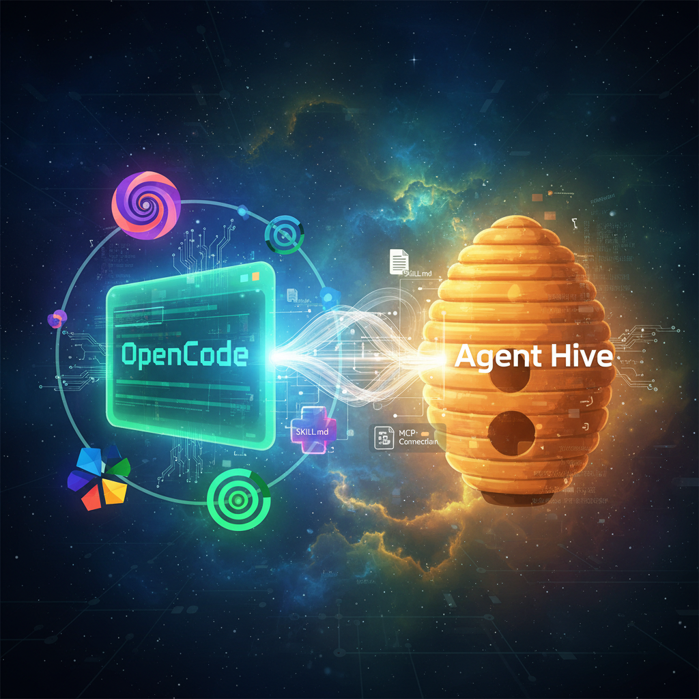
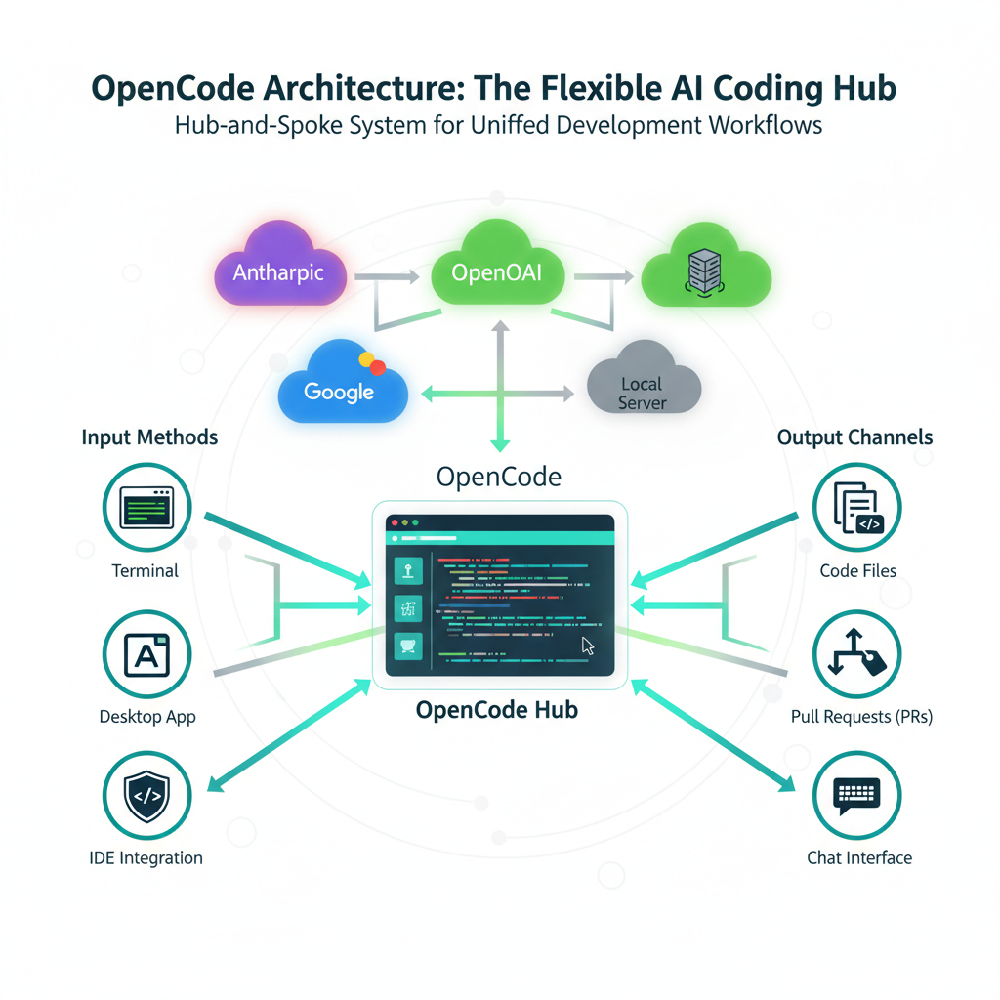
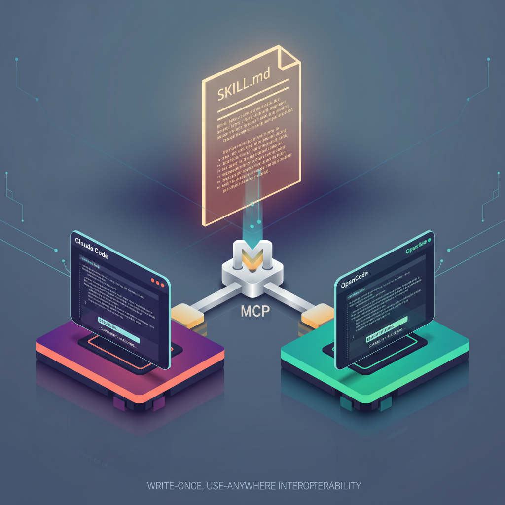
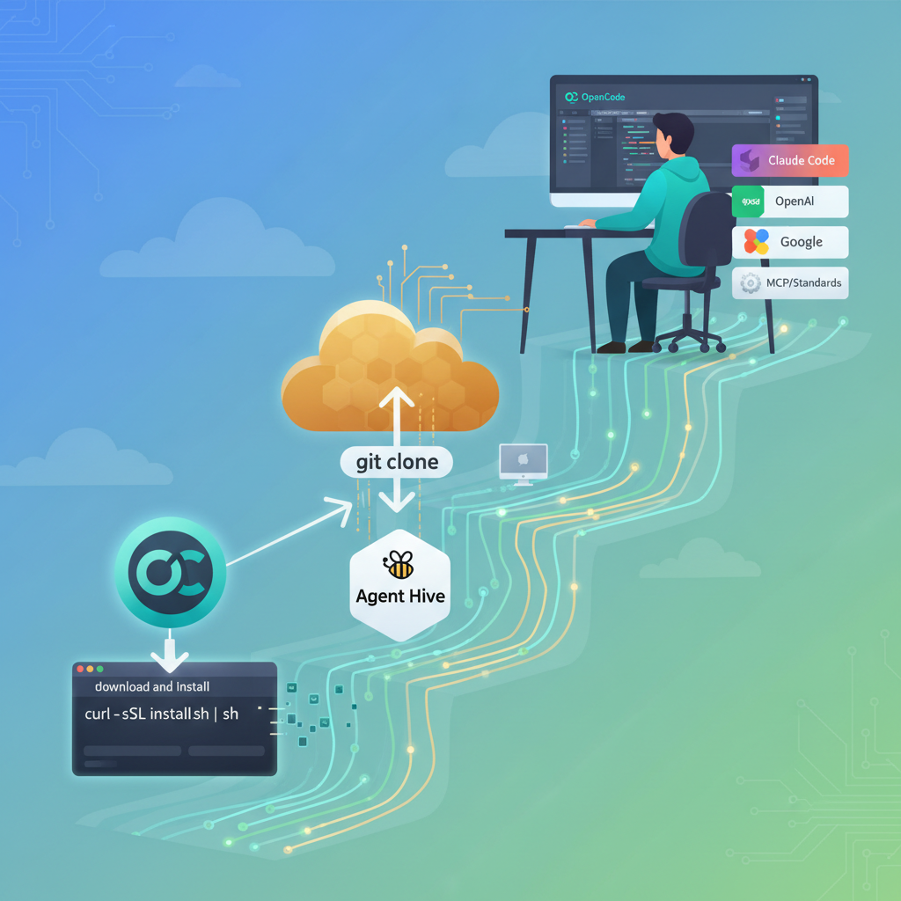
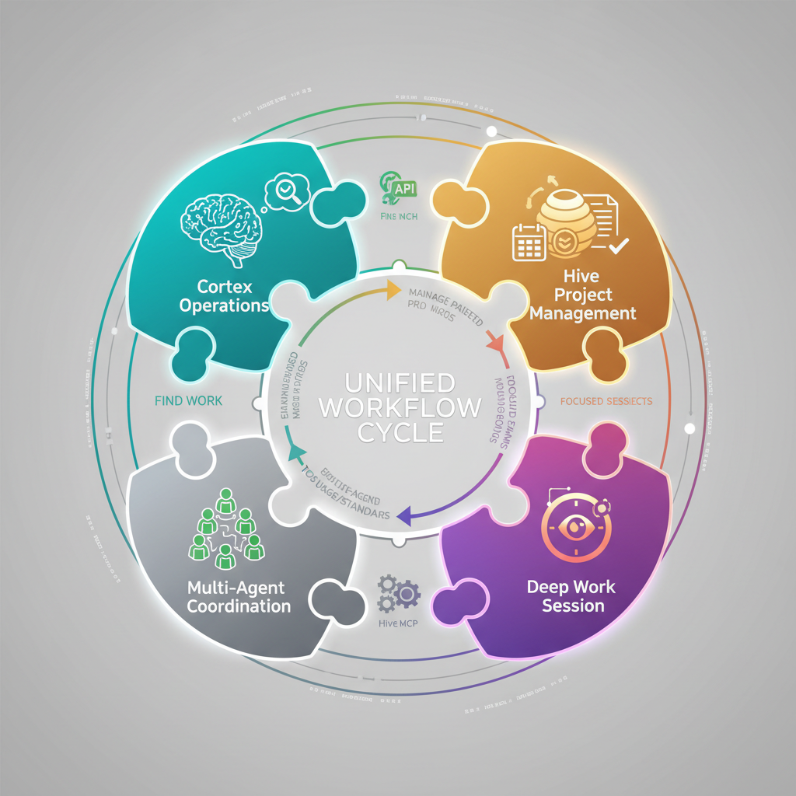
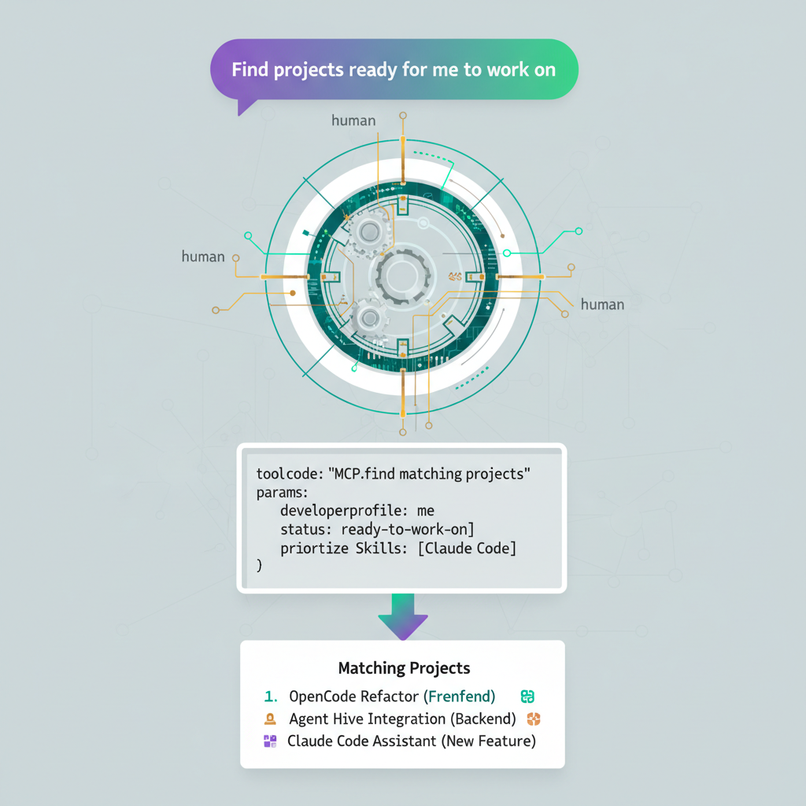
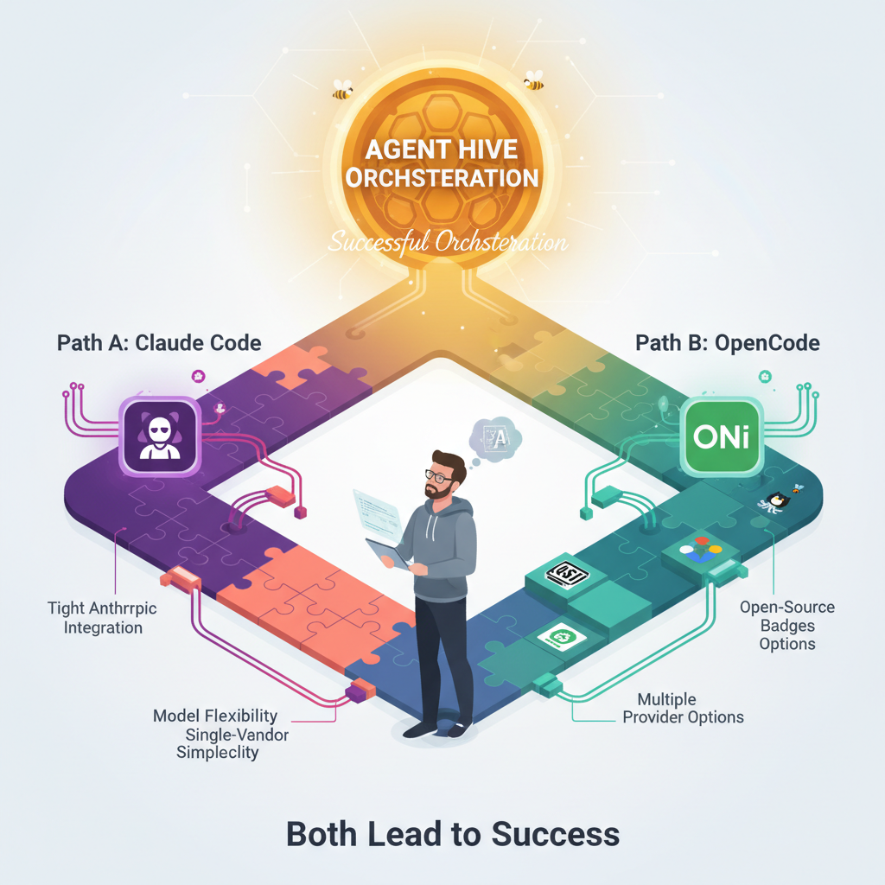
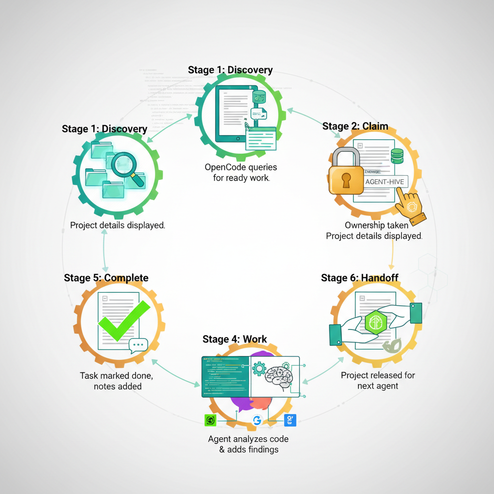

# Agent Hive Meets OpenCode

*How Agent Hive extends its vendor-agnostic philosophy by adding full support for OpenCode, the open-source AI coding agent.*

Published: [Date]

- [Substack](link)
- [X.com](link)

---


*Two open philosophies unite: Agent Hive's vendor-agnostic orchestration meets OpenCode's model-independent coding agent.*

---

## The Promise of Choice

Agent Hive was built on a simple premise: AI agent orchestration shouldn't lock you into a single vendor. Your projects, your workflows, your coordination patterns should work regardless of whether you're using Claude, GPT, Gemini, or any other model.

OpenCode embodies the same philosophy for the AI coding agent itself. Claude Code ties you to Anthropic's models. OpenCode lets you use any provider through a unified interface.

What happens when these two projects align? A fully open, fully flexible AI development stack. You choose both the orchestration layer and the execution engine.

## What is OpenCode?

OpenCode is an open-source AI coding agent from SST. It runs in your terminal, IDE, or as a desktop app:

- **Multi-model support**: Works with Claude, GPT-5, Gemini, local models, and more
- **Skills system**: Loads specialized instructions via SKILL.md files
- **MCP integration**: Connects to external tools through Model Context Protocol
- **Built-in agents**: Pre-configured Build and Plan agents with Tab switching
- **Client/server architecture**: Run locally or drive remotely


*OpenCode's architecture: Terminal, desktop, or IDE interface connecting to any model provider through a unified API.*

---

## Why Agent Hive + OpenCode?

The integration delivers three benefits.

### 1. True Vendor Independence

Claude Code offers excellent orchestration, but locks you to Claude. With OpenCode + Agent Hive:

- Use GPT-5 for coding while Claude handles Cortex analysis
- Run Gemini locally for cost-sensitive projects
- Switch providers based on task requirements without rewriting workflows

### 2. Same Skills, Different Engines

Agent Hive skills work identically across both platforms because they share the same SKILL.md format:

```yaml
---
name: skill-name
description: What this skill does and when to use it
---

# Skill Instructions
[Markdown content teaching the agent how to perform tasks]
```

Write once, use anywhere. Whether Claude Code or OpenCode loads the skill, it learns the same instructions.

### 3. Full MCP Tool Access

Both platforms support Model Context Protocol. The Hive MCP server works with either:

```json
{
  "mcp": {
    "hive": {
      "type": "local",
      "command": ["uv", "run", "python", "-m", "src.hive_mcp"],
      "enabled": true
    }
  }
}
```

Same tools. Same API. Different execution engines.


*One skill format, one MCP server, multiple agents: Agent Hive achieves true interoperability across AI coding platforms.*

---

## Setting Up OpenCode with Agent Hive

Agent Hive ships with OpenCode support out of the box.

### Directory Structure

```
agent-hive/
├── .claude/
│   └── skills/                  # Claude Code skills
│       ├── cortex-operations/
│       ├── deep-work-session/
│       ├── hive-mcp/
│       ├── hive-project-management/
│       └── multi-agent-coordination/
├── .opencode/
│   ├── skill/                   # OpenCode skills (same content)
│   │   ├── cortex-operations/
│   │   ├── deep-work-session/
│   │   ├── hive-mcp/
│   │   ├── hive-project-management/
│   │   └── multi-agent-coordination/
│   └── opencode.json            # MCP configuration
└── src/
    └── hive_mcp/                # MCP server (works with both)
```

### Installation

1. **Install OpenCode**:

```bash
curl -fsSL https://opencode.ai/install | bash
```

2. **Clone Agent Hive**:

```bash
git clone https://github.com/intertwine/hive-orchestrator.git
cd hive-orchestrator
```

3. **Start OpenCode**:

```bash
opencode
```

Done. Skills load from `.opencode/skill/`. MCP tools configure from `.opencode/opencode.json`.


*Three commands to full integration: install OpenCode, clone Agent Hive, start coding.*

---

## Available Skills

All five core Agent Hive skills work with OpenCode:

### cortex-operations

Run the Cortex orchestration engine:

```bash
# Find ready work without LLM calls
uv run python -m src.cortex --ready

# Analyze dependency graph
uv run python -m src.cortex --deps

# Run full orchestration
uv run python -m src.cortex
```

### hive-project-management

Manage AGENCY.md files:

- Create new projects with proper frontmatter
- Manage status, owner, blocked fields
- Add timestamped agent notes
- Handle dependencies between projects

### deep-work-session

Structure focused work:

- Session lifecycle: ENTER → CLAIM → WORK → UPDATE → HANDOFF
- Claiming and releasing projects
- The handoff protocol for clean transitions
- Blocking and unblocking workflows

### multi-agent-coordination

Enable collaboration:

- Ownership protocol for conflict prevention
- Dependency management patterns
- Real-time coordinator integration
- Communication via Agent Notes

### hive-mcp

Use MCP tools:

- All 12 available tools with arguments
- Response format handling
- Workflow examples for common tasks
- Coordinator integration


*Five skills, one complete workflow: From finding ready work to multi-agent coordination, OpenCode learns the full Agent Hive protocol.*

---

## MCP Integration

The Hive MCP server exposes 12 tools that work identically with OpenCode and Claude Code:

| Tool | Description |
|------|-------------|
| `list_projects` | List all projects with metadata |
| `get_ready_work` | Find claimable projects |
| `get_project` | Get full project details |
| `claim_project` | Set owner to claim work |
| `release_project` | Release ownership |
| `update_status` | Change project status |
| `add_note` | Add timestamped notes |
| `get_dependencies` | Check blocking status |
| `get_dependency_graph` | Full dependency view |
| `coordinator_status` | Coordinator health check |
| `coordinator_claim` | Real-time claim |
| `coordinator_release` | Real-time release |

### Configuration

OpenCode loads MCP configuration from `.opencode/opencode.json`:

```json
{
  "$schema": "https://opencode.ai/config.json",
  "mcp": {
    "hive": {
      "type": "local",
      "command": ["uv", "run", "python", "-m", "src.hive_mcp"],
      "enabled": true,
      "environment": {
        "HIVE_BASE_PATH": ".",
        "COORDINATOR_URL": "http://localhost:8080"
      }
    }
  }
}
```

### Usage

Once configured, use natural language:

```
User: Find projects ready for me to work on

OpenCode: [Uses hive.get_ready_work tool]
I found 2 projects ready:
- feature-auth (high priority)
- docs-update (medium priority)

Want me to claim one?
```


*Natural language meets structured tools: Ask for ready work, claim projects, update status. All through conversation.*

---

## Platform Comparison

| Feature | Claude Code | OpenCode |
|---------|-------------|----------|
| **Model** | Claude only | Any provider |
| **Skills Location** | `.claude/skills/` | `.opencode/skill/` |
| **Skills Format** | SKILL.md | SKILL.md (identical) |
| **MCP Support** | Native | Native |
| **Config File** | `claude.json` | `opencode.json` |
| **Built-in Agents** | Single | Build/Plan (Tab toggle) |
| **Price** | Anthropic API | Free + any API |
| **Open Source** | No | Yes (MIT) |

### When to Use Each

**Choose Claude Code when:**
- You want tight integration with Claude models
- Your team is standardized on Anthropic
- You prefer a single-vendor relationship

**Choose OpenCode when:**
- You need model flexibility
- Cost optimization requires switching providers
- You want local models for privacy
- Open-source tooling matters

**Use both when:**
- Different team members prefer different tools
- Some tasks benefit from Claude, others from GPT/Gemini
- You're evaluating before standardizing


*Choose your path: Both roads lead to effective Agent Hive orchestration. Pick the one that fits your constraints.*

---

## A Complete Workflow

Using OpenCode with Agent Hive:

### 1. Find Ready Work

```bash
$ opencode

> What projects are ready?

OpenCode: Let me check...
[Runs cortex --ready]

Found 1 project ready:
- security-audit (high priority)
  Path: projects/security-audit/AGENCY.md
```

### 2. Review the Project

```
> Show me security-audit details

OpenCode: [Uses hive.get_project]

Project: security-audit
Status: active
Owner: null (unclaimed)
Priority: high

Tasks:
- [ ] Audit authentication system
- [ ] Check for injection vulnerabilities
- [ ] Review API authorization
```

### 3. Claim and Work

```
> Claim it and start the first task

OpenCode: [Uses hive.claim_project]

Claimed. Owner: "opencode-gpt4".

Analyzing authentication...
[Reads src/security.py, src/coordinator.py]

Findings:
1. Safe YAML loading prevents RCE ✓
2. API key auth with timing-safe comparison ✓
3. Path traversal validation ✓

Adding notes...
[Uses hive.add_note]
```

### 4. Complete and Handoff

```
> Mark the task complete and release

OpenCode: [Updates AGENCY.md]
[Uses hive.release_project]

Done. Notes added:
- **2025-01-15 14:30 - opencode-gpt4**: Completed auth audit.
  Patterns follow security best practices.
  Next: injection vulnerability scan.
```


*From discovery to handoff: A complete work cycle using OpenCode with Agent Hive's orchestration primitives.*

---

## Advanced Configuration

### Global Skills

Install skills system-wide:

```bash
# Copy to global config
cp -r .opencode/skill/* ~/.config/opencode/skill/

# Verify
ls ~/.config/opencode/skill/
```

### Custom Agents

Create a specialized Hive agent in `.opencode/agent/hive.md`:

```yaml
---
name: hive
description: Specialized agent for Agent Hive orchestration
model: anthropic/claude-sonnet-4
tools:
  read: true
  write: true
  bash: true
  mcp__hive__*: true
---

You are an AI agent specialized in Agent Hive orchestration.
Always check for ready work before starting.
Follow the handoff protocol when finishing.
```

### Multiple Hives

Configure multiple MCP servers:

```json
{
  "mcp": {
    "hive-main": {
      "type": "local",
      "command": ["uv", "run", "python", "-m", "src.hive_mcp"],
      "environment": { "HIVE_BASE_PATH": "/projects/main-hive" }
    },
    "hive-experimental": {
      "type": "local",
      "command": ["uv", "run", "python", "-m", "src.hive_mcp"],
      "environment": { "HIVE_BASE_PATH": "/projects/experimental-hive" }
    }
  }
}
```

---

## The Bigger Picture

Agent Hive's OpenCode integration signals something beyond technical compatibility. It points to where AI-assisted development is heading.

The industry is moving toward:

1. **Tool interoperability**: Skills and protocols that work across platforms
2. **Model flexibility**: Freedom to choose and switch AI providers
3. **Open standards**: MCP as a universal tool integration layer
4. **Composable workflows**: Mix and match components from different vendors

Agent Hive + OpenCode shows this future is already here. Orchestrate AI agents with Markdown files. Coordinate across vendors. Switch execution engines without rewriting workflows.

Open primitives. Real power.

---

## Getting Started

1. **Install OpenCode**: `curl -fsSL https://opencode.ai/install | bash`
2. **Clone Agent Hive**: `git clone https://github.com/intertwine/hive-orchestrator.git`
3. **Navigate to repo**: `cd hive-orchestrator`
4. **Start OpenCode**: `opencode`
5. **Ask for help**: "What projects are ready?"

Skills and MCP tools are pre-configured. Start orchestrating with whichever model you prefer.

---

## Further Reading

- [OpenCode Documentation](https://opencode.ai/docs/)
- [Agent Hive README](https://github.com/intertwine/hive-orchestrator)
- [Skills and Protocols Article](05-skills-and-protocols-teaching-agents-to-work-in-agent-hive.md)
- [Hive MCP Server Guide](.claude/skills/hive-mcp/SKILL.md)

---

*Agent Hive: Vendor-agnostic orchestration meets model-agnostic execution. Choose your tools, keep your workflows.*
