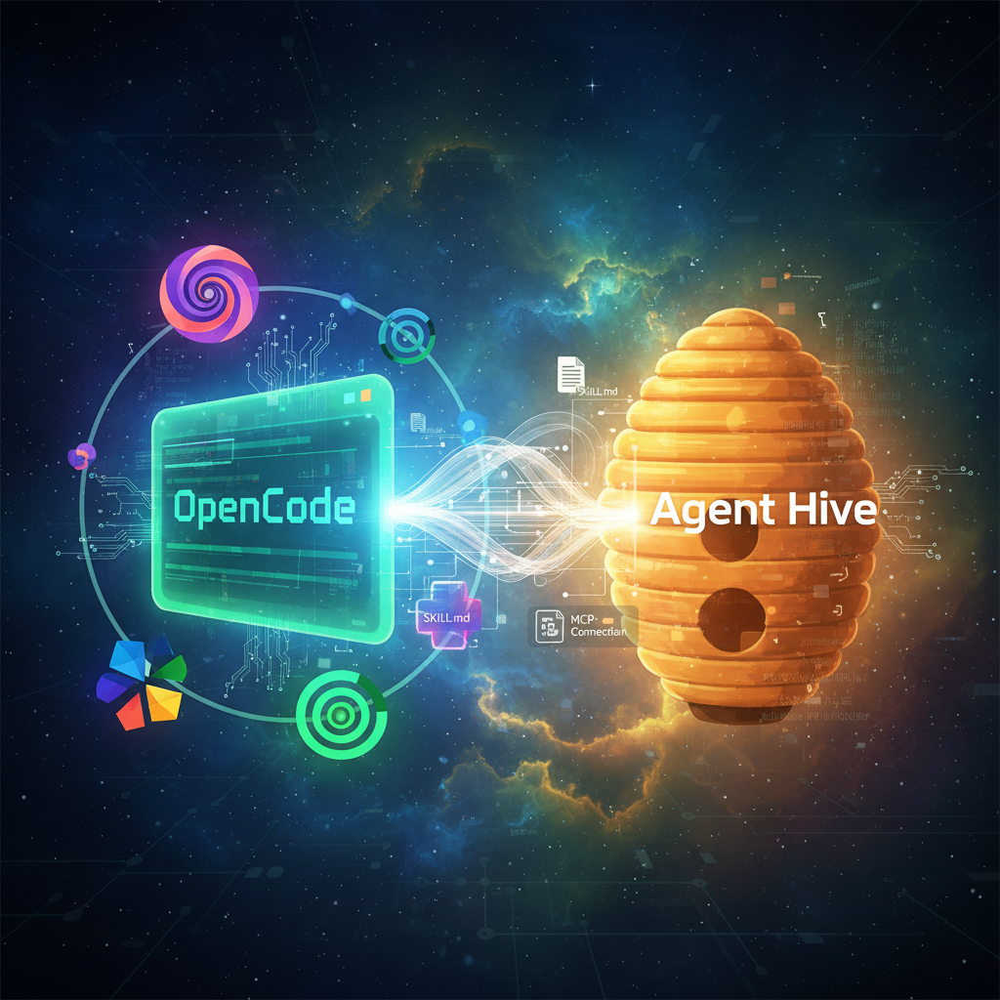

# Agent Hive Meets OpenCode

_OpenCode is another good harness for Hive, not a fork in the architecture._

---


_Hive works best when the orchestration layer stays stable and the interactive harness stays swappable._

---

## Why This Pairing Makes Sense

Hive is built around a vendor-agnostic idea:

the orchestration layer should outlive any one model provider or coding shell.

OpenCode fits that mindset well because it is another flexible harness rather than a closed hosted platform you have to design around.

That makes the pairing simple:

- Hive handles the durable coordination layer
- OpenCode handles the interactive coding experience

## What The Integration Looks Like Today

Hive already ships the core pieces you need for OpenCode:

- `.opencode/skill/` with Hive-specific skills
- `.opencode/opencode.json` with MCP configuration
- the thin Hive MCP server
- the same CLI surfaces used by other harnesses

This is intentionally boring.

The point is not to create an OpenCode-only version of Hive. The point is to let OpenCode speak the same operating language as the rest of the system.

## The Big Benefit: Same Workflow, Different Harness

An OpenCode user should still work roughly like this:

```bash
hive task ready --json
hive task claim task_ABC --owner opencode --json
hive context startup --project demo --task task_ABC --json
```

Then, after the work:

```bash
hive task update task_ABC --status review --json
hive sync projections --json
```

That is the real win.

You do not need a parallel "OpenCode way" of using Hive.

## Skills Matter More Than Branding

The shipped OpenCode skills teach the same habits Hive expects elsewhere:

- use canonical task state
- treat `AGENCY.md` as narrative context
- read `PROGRAM.md`
- respect handoff protocol
- prefer the CLI for authoritative operations

That shared protocol is what keeps the experience coherent across harnesses.

## MCP Is The Glue, Not The Whole Story

OpenCode can use Hive through MCP, but MCP is not the whole integration.

The broader picture is:

- CLI for authoritative operations
- skills for behavior
- MCP for thin tool access like `search` and `execute`

That layered approach is cleaner than trying to force every Hive action through a single tool server.

## Where OpenCode Fits Best

OpenCode is a strong fit when you want:

- a flexible interactive coding harness
- the same orchestration model used elsewhere in Hive
- the ability to move between local and team workflows without changing the underlying state model

It is especially attractive if you want to keep your orchestration system independent from your day-to-day coding shell.

## What Hive Does Not Need From OpenCode

Hive does not need a special OpenCode-only state model.
It does not need OpenCode-specific task files.
It does not need the orchestration repo to become an OpenCode plugin project.

That restraint is good.

The best integrations usually look smaller than people expect.

## Bottom Line

OpenCode is a good match for Hive because it fits the same broad idea: keep the core portable, keep the interfaces plain, and do not weld the system to one vendor.

That is exactly the kind of harness Hive should work well with.
