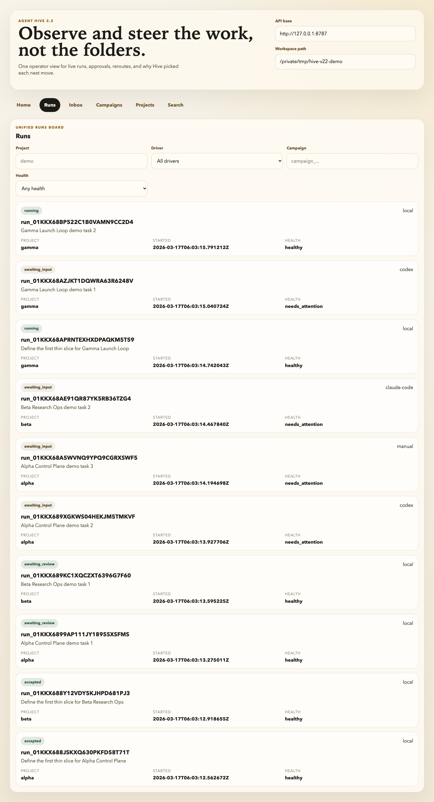
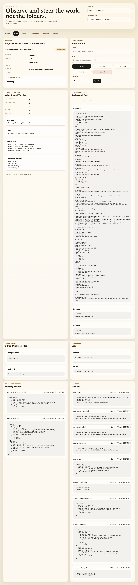

# Hive 2.2 Demo Walkthrough

This is the shortest path to a real launch-quality demo of Hive 2.2.

It builds the same north-star shape we use in acceptance:

- three projects
- ten runs across local, Codex, Claude Code, and manual flows
- a reroute with preserved lineage
- a campaign-generated daily brief
- accepted runs with evaluator evidence and context manifests

## 1. Build the demo workspace

Use a throwaway directory outside this repository:

```bash
uv run python scripts/build_v22_demo_workspace.py /tmp/hive-v22-demo --force
```

That writes the fixture manifest to:

```bash
/tmp/hive-v22-demo/.hive/demo/north_star_manifest.json
```

## 2. Serve the console

In a second terminal:

```bash
uv run hive --path /tmp/hive-v22-demo console serve --host 127.0.0.1 --port 8787
```

Then open:

```text
http://127.0.0.1:8787/console/?workspace=/tmp/hive-v22-demo
```

The console will prefill the workspace path from the URL so the demo opens ready to use.

## 3. Record screenshots and a short walkthrough clip

The capture helper lives with the React console package at
`frontend/console/scripts/captureDemoAssets.mjs`:

```bash
cd frontend/console
pnpm install
pnpm exec playwright install chromium
pnpm capture-demo -- \
  --manifest /tmp/hive-v22-demo/.hive/demo/north_star_manifest.json \
  --base-url http://127.0.0.1:8787 \
  --output-dir ../../images/launch
```

That generates:

- `images/launch/console-home.png`
- `images/launch/console-inbox.png`
- `images/launch/console-runs.png`
- `images/launch/console-run-detail.png`
- `images/launch/observe-and-steer-demo.webm`

The latest generated assets are checked into this repository, so you can review the exact launch views
without recreating the fixture first.






## 4. Suggested live narration

1. Start on Home and show the recommendation, active runs, inbox, blockers, and campaign summary.
2. Jump to Runs and point out that one operator can monitor the whole portfolio in one board.
3. Open Inbox and show that approval and input requests land in one place without manual sync.
4. Open the rerouted run detail and show the steering history, context inspector, evaluator evidence, and diff preview.
5. Close on the idea that Hive is the control plane above the worker harness, not a replacement for it.

## 5. What this proves

This walkthrough is meant to make the release checklist concrete:

- the operator can monitor multiple projects and runs in one console
- steering is typed and visible in the audit trail
- accepted work can explain why it passed
- campaigns and daily briefs are part of the same control surface
- the same control plane can sit above Codex, Claude Code, local execution, and manual handoffs
